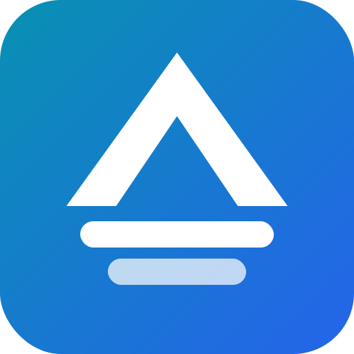

# AriaDeck



Native Rust desktop client for [aria2](https://aria2.github.io/). GPUI UI; independent `aria2c` over JSON-RPC (WebSocket).

**Active development.** Architecture & contracts: [`docs/project-context.md`](docs/project-context.md).  
**What to build next:** [`docs/roadmap.md`](docs/roadmap.md).

## Development

- Rust 1.96.0 (`rust-toolchain.toml`)
- Windows / macOS / Linux with GPUI support

```sh
cargo run -p ariadeck-desktop

cargo fmt --all --check
cargo test --workspace
cargo clippy --workspace --all-targets -- -D warnings
```

### External aria2 RPC

`ARIADECK_RPC_URL` → existing instance (explicit `…/jsonrpc` only). Secret: `ARIADECK_RPC_SECRET` (not in URL).  
Plain `ws://` defaults to loopback; remote plaintext needs `ARIADECK_RPC_ALLOW_INSECURE_REMOTE=true`. WSS uses OS trust store (no bypass). No HTTP auto-fallback.

| Variable | Default |
| --- | --- |
| `ARIADECK_RPC_CONNECT_TIMEOUT_MS` | local `750`, external `10000` |
| `ARIADECK_RPC_REQUEST_TIMEOUT_MS` | local `5000`, external `15000` |
| `ARIADECK_RPC_RECONNECT_BASE_DELAY_MS` | `250` |
| `ARIADECK_RPC_RECONNECT_MAX_DELAY_MS` | `30000` |
| `ARIADECK_RPC_RECONNECT_RESET_AFTER_MS` | `10000` |
| `ARIADECK_RPC_RECONNECT_MAX_ATTEMPTS` | unlimited when unset |

## Releases (Windows portable)

Portable zip + optional Inno installer. **No** bundled aria2—import a core in Settings or use `ARIADECK_RPC_URL`.

```powershell
python scripts/gen_third_party_notices.py
powershell -ExecutionPolicy Bypass -File scripts/package-windows-portable.ps1
```

`ariadeck.portable` next to the exe → data under `./data`. Installed builds use `%LOCALAPPDATA%\AriaDeck` (kept on uninstall by default).

Details: [`docs/release.md`](docs/release.md).

## Architecture

Domain/application stay free of GPUI, wire models, and process I/O. Desktop is the composition root; pages use `ariadeck-ui` only.

| Crate | Role |
| --- | --- |
| `ariadeck-domain` | IDs, task/engine/transfer types, privacy helpers |
| `ariadeck-application` | Store, sync, commands, ports, views |
| `ariadeck-engine` | Process lifecycle, cores, profile lock |
| `ariadeck-rpc` | Authenticated WS JSON-RPC + typed adapter |
| `ariadeck-ui` | Design tokens + GPUI components |
| `ariadeck-settings` | Versioned settings + migrations |
| `ariadeck-i18n` | Fluent (en, zh-CN) |
| `ariadeck-telemetry` | Tracing |
| `ariadeck-desktop` | Bootstrap / composition root |

More: [`docs/project-context.md`](docs/project-context.md) · i18n: [`docs/i18n.md`](docs/i18n.md)  
License: [MIT](LICENSE) · Third-party: [`THIRD_PARTY_NOTICES.md`](THIRD_PARTY_NOTICES.md)
